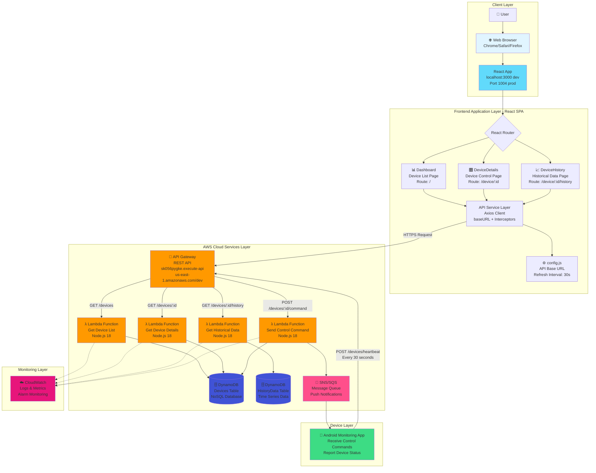
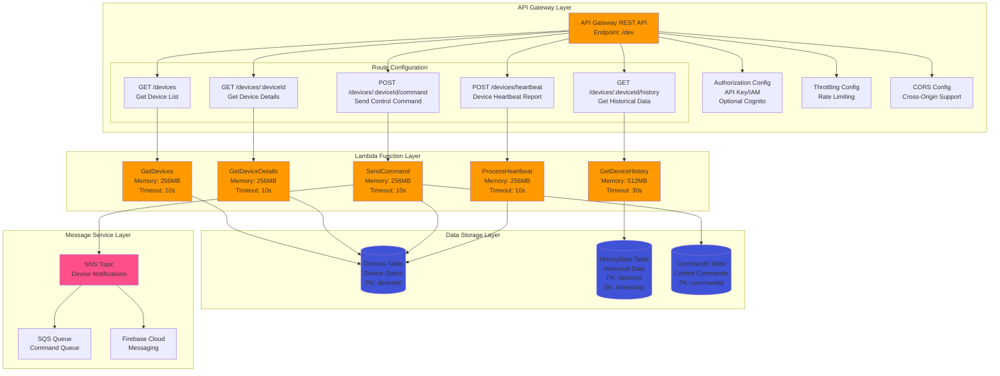
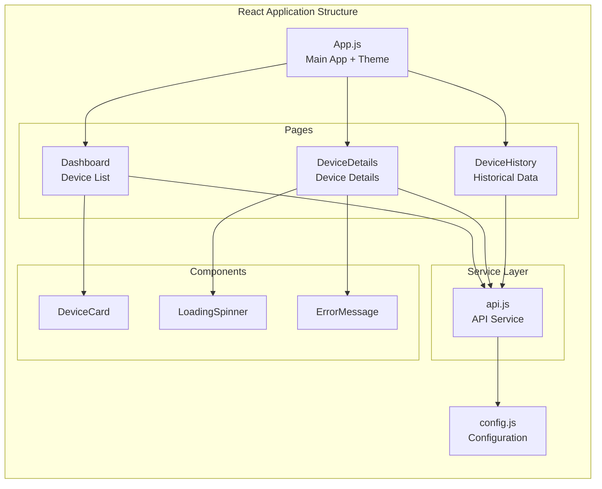
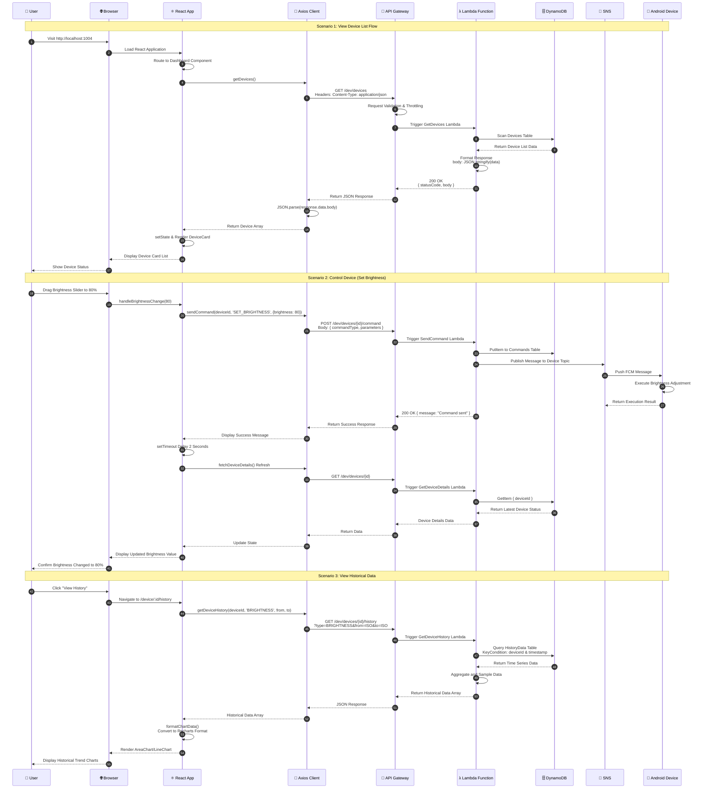
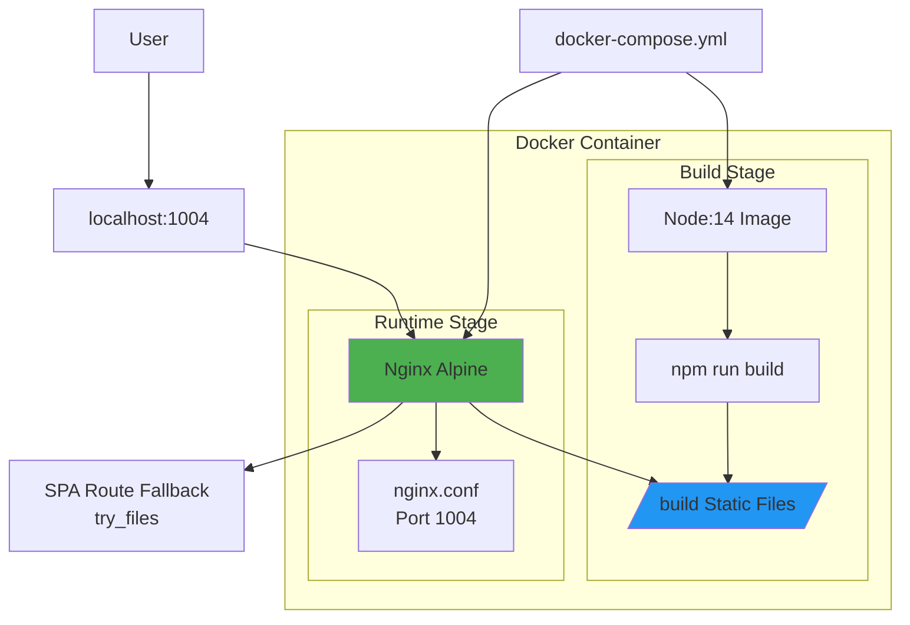

# Android Monitoring System (AMS) - Web Dashboard

A React-based web dashboard for remote monitoring and control of Android devices.

[中文文档](README.zh.md) | English

## Features

- 📱 Real-time monitoring of multiple Android devices
- 📊 Device historical data visualization (Brightness, WiFi, Bluetooth)
- 🎛️ Remote device control (WiFi toggle, Bluetooth toggle, Screen brightness adjustment)
- 🔄 Auto-refresh (30-second interval)
- 📈 Multi-timeframe historical data queries (1 hour, 6 hours, 24 hours, 7 days)
- 🐳 Docker containerized deployment support

## Tech Stack

- **Frontend Framework**: React 18.2.0
- **UI Component Library**: Material-UI (MUI) 5.14.20
- **Routing**: React Router DOM 6.20.1
- **Chart Library**: Recharts 2.8.0
- **HTTP Client**: Axios 1.6.2
- **Build Tool**: React Scripts 5.0.1
- **Containerization**: Docker + Docker Compose
- **Web Server**: Nginx (Alpine)

## Quick Start

### Prerequisites

- Node.js 14+
- npm or yarn
- Docker and Docker Compose (for containerized deployment)

### Local Development

```bash
# Install dependencies
npm install

# Start development server (http://localhost:3000)
npm start

# Run tests
npm test

# Build for production
npm run build
```

### Docker Deployment

```bash
# Build and start container
docker-compose up --build

# Run in background
docker-compose up -d

# Stop container
docker-compose down
```

Access after deployment: `http://localhost:1004`

## System Architecture

### Complete System Architecture Diagram (Text Version)

```
┌─────────────────────────────────────────────────────────────────────────┐
│                         👤 User                                          │
└────────────────────────────────┬────────────────────────────────────────┘
                                 │ Browser Access
                                 │ http://localhost:1004
┌────────────────────────────────▼────────────────────────────────────────┐
│                    Frontend Layer (React 18.2.0)                        │
│  ┌─────────────────────────────────────────────────────────────┐       │
│  │                     App.js (Main App)                        │       │
│  │  • ThemeProvider (Material-UI)                               │       │
│  │  • React Router (Client-side routing)                        │       │
│  │  • AppBar (Navigation bar)                                   │       │
│  └──────────────────────┬──────────────────────────────────────┘       │
│                         │                                                │
│  ┌──────────────────────┼──────────────────────────────────────┐       │
│  │                      │   Page Components                      │       │
│  │  ┌──────────────┐   │   ┌──────────────┐   ┌─────────────┐ │       │
│  │  │  Dashboard   │◄──┼──►│DeviceDetails │   │DeviceHistory│ │       │
│  │  │   (/)        │   │   │ (/device/:id)│   │(/device/:id/│ │       │
│  │  │              │   │   │              │   │   history)  │ │       │
│  │  │ • Device List│   │   │ • WiFi Ctrl  │   │ • Charts    │ │       │
│  │  │ • Status Mon │   │   │ • BT Control │   │ • Time Range│ │       │
│  │  │ • Auto Refresh│  │   │ • Brightness │   │ • Data Type │ │       │
│  │  └──────┬───────┘   │   └──────┬───────┘   └──────┬──────┘ │       │
│  └─────────┼───────────┴──────────┼──────────────────┼────────┘       │
│            │                       │                  │                  │
│  ┌─────────▼───────────────────────▼──────────────────▼────────┐       │
│  │              Shared Components                                │       │
│  │  • DeviceCard     • LoadingSpinner     • ErrorMessage        │       │
│  └───────────────────────────┬───────────────────────────────────┘       │
│                               │                                           │
│  ┌────────────────────────────▼──────────────────────────────────┐      │
│  │                 API Service Layer (api.js)                     │      │
│  │  • Axios Client (baseURL, timeout: 10s)                       │      │
│  │  • Request Interceptor (logging)                              │      │
│  │  • Response Interceptor (error handling)                      │      │
│  │                                                                │      │
│  │  Methods:                                                      │      │
│  │    - getDevices()           GET  /devices                     │      │
│  │    - getDeviceDetails(id)   GET  /devices/:id                 │      │
│  │    - getDeviceHistory(...)  GET  /devices/:id/history         │      │
│  │    - sendCommand(...)       POST /devices/:id/command         │      │
│  └────────────────────────────┬──────────────────────────────────┘      │
│                                │                                          │
│  ┌────────────────────────────▼──────────────────────────────────┐      │
│  │                  config.js (Configuration)                     │      │
│  │  • apiBaseUrl: AWS API Gateway Endpoint                       │      │
│  │  • refreshInterval: 30000ms (30s auto-refresh)                │      │
│  └────────────────────────────┬──────────────────────────────────┘      │
└─────────────────────────────────┼──────────────────────────────────────┘
                                  │ HTTPS/REST
                                  │ Content-Type: application/json
┌──────────────────────────────────▼─────────────────────────────────────┐
│                      AWS Cloud Services Layer                           │
│                                                                          │
│  ┌──────────────────────────────────────────────────────────────┐      │
│  │           🚪 API Gateway (REST API)                           │      │
│  │  Endpoint: sk056pygke.execute-api.us-east-1.amazonaws.com    │      │
│  │  Stage: /dev                                                  │      │
│  │                                                               │      │
│  │  Features:                                                    │      │
│  │    • CORS (Cross-Origin Resource Sharing)                    │      │
│  │    • Throttling (Rate limiting: 10,000 req/sec)              │      │
│  │    • API Key / IAM Authentication (optional)                 │      │
│  │    • CloudWatch Logging                                       │      │
│  └─────────┬────────────────────────────────────────────────────┘      │
│            │                                                             │
│  ┌─────────┼─────────────────────────────────────────────────────┐     │
│  │         │         Lambda Functions (Node.js 18)               │     │
│  │         │                                                      │     │
│  │  ┌──────▼──────────┐  ┌───────────────┐  ┌────────────────┐ │     │
│  │  │ GetDevices      │  │GetDeviceDetails│  │GetDeviceHistory│ │     │
│  │  │ GET /devices    │  │GET /devices/:id│  │GET /devices/:id│ │     │
│  │  │ Memory: 256MB   │  │Memory: 256MB   │  │    /history    │ │     │
│  │  │ Timeout: 10s    │  │Timeout: 10s    │  │Memory: 512MB   │ │     │
│  │  └──────┬──────────┘  └───────┬────────┘  └────────┬───────┘ │     │
│  │         │                     │                     │          │     │
│  │  ┌──────▼──────────┐  ┌──────▼─────────┐                     │     │
│  │  │ SendCommand     │  │ProcessHeartbeat│                     │     │
│  │  │ POST /devices/  │  │POST /devices/  │                     │     │
│  │  │    :id/command  │  │   heartbeat    │                     │     │
│  │  │ Memory: 256MB   │  │Memory: 256MB   │                     │     │
│  │  │ Timeout: 10s    │  │Timeout: 10s    │                     │     │
│  │  └──────┬──────────┘  └───────┬────────┘                     │     │
│  │         │                     │                               │     │
│  │         └──────────┬──────────┴───────────┬──────────────────┘     │
│  │                    │                      │                         │
│  │         ┌──────────▼──────────┐          │                         │
│  │         │  📢 SNS/SQS         │          │                         │
│  │         │  Message Queue      │          │                         │
│  │         │  • Topic: device-   │          │                         │
│  │         │    commands         │          │                         │
│  │         │  • FCM Push         │          │                         │
│  │         └──────────┬──────────┘          │                         │
│  └────────────────────┼─────────────────────┼─────────────────────────┘
│                       │                     │
│  ┌────────────────────┼─────────────────────▼─────────────────────┐   │
│  │                    │        🗄️ DynamoDB (NoSQL)                │   │
│  │                    │                                            │   │
│  │  ┌─────────────────▼─────────┐  ┌──────────────────────────┐  │   │
│  │  │     Devices Table          │  │   HistoryData Table      │  │   │
│  │  │  PK: deviceId              │  │   PK: deviceId           │  │   │
│  │  │                            │  │   SK: timestamp          │  │   │
│  │  │  Attributes:               │  │                          │  │   │
│  │  │  • lastSeen                │  │   Attributes:            │  │   │
│  │  │  • lastUpdated             │  │   • dataType             │  │   │
│  │  │  • wifi {status, ssid}     │  │   • value                │  │   │
│  │  │  • bluetooth {status,      │  │   • status               │  │   │
│  │  │    pairedDevices}          │  │   • ttl (30-day cleanup) │  │   │
│  │  │  • screen {brightness}     │  │                          │  │   │
│  │  └────────────────────────────┘  └──────────────────────────┘  │   │
│  │                                                                  │   │
│  │  ┌──────────────────────────────────────────────────────────┐  │   │
│  │  │              Commands Table                               │  │   │
│  │  │  PK: commandId (UUID)                                     │  │   │
│  │  │  GSI: deviceId-timestamp-index                            │  │   │
│  │  │                                                            │  │   │
│  │  │  Attributes:                                              │  │   │
│  │  │  • deviceId                                               │  │   │
│  │  │  • commandType (SET_BRIGHTNESS, TOGGLE_WIFI, etc.)       │  │   │
│  │  │  • parameters                                             │  │   │
│  │  │  • status (PENDING, SENT, EXECUTED, FAILED)              │  │   │
│  │  └──────────────────────────────────────────────────────────┘  │   │
│  └──────────────────────────────────────────────────────────────────┘   │
│                                                                          │
│  ┌──────────────────────────────────────────────────────────────┐      │
│  │              ☁️ CloudWatch (Monitoring & Logging)             │      │
│  │  • Lambda invocations, errors, duration                      │      │
│  │  • API Gateway 4xx/5xx error rates                           │      │
│  │  • DynamoDB read/write capacity monitoring                   │      │
│  │  • Alarms: Error rate > 5%, Latency > 2s                    │      │
│  └──────────────────────────────────────────────────────────────┘      │
└────────────────────────────────┬────────────────────────────────────────┘
                                 │ FCM Push / Pull
                                 │ Command Execution
┌────────────────────────────────▼────────────────────────────────────────┐
│                      📱 Device Layer (Android)                          │
│                                                                          │
│  ┌──────────────────────────────────────────────────────────────┐      │
│  │              Android Monitoring App                           │      │
│  │                                                                │      │
│  │  Features:                                                     │      │
│  │    • Receive FCM push control commands                        │      │
│  │    • Execute device controls (WiFi, Bluetooth, Brightness)    │      │
│  │    • Report device status to API Gateway every 30 seconds     │      │
│  │    • Return command execution results                         │      │
│  │                                                                │      │
│  │  Heartbeat Reporting:                                          │      │
│  │    POST /devices/heartbeat                                    │      │
│  │    Body: { deviceId, wifi, bluetooth, screen, timestamp }    │      │
│  └──────────────────────────────────────────────────────────────┘      │
└──────────────────────────────────────────────────────────────────────────┘

Data Flow:
  1. User Action → React Component Update → API Service Request
  2. Axios → API Gateway → Lambda Function Processing
  3. Lambda → DynamoDB Read/Write → Return Data
  4. Lambda → SNS → Android Device Push Command
  5. Android Device → API Gateway → Status Update Report
```

### Complete System Architecture Diagram (Mermaid Chart Version)



### AWS Service Layer Detailed Architecture



### Frontend Architecture



### Detailed Data Flow Diagram



### Deployment Architecture



## Data Model Design

### DynamoDB Table Structure

#### 1. Devices Table (Device Status)
```javascript
{
  // Primary Key
  "deviceId": "device_001",  // Partition Key

  // Device Information
  "lastSeen": "2025-11-10T10:30:00Z",      // Last Online Time
  "lastUpdated": "2025-11-10T10:30:00Z",   // Last Update Time

  // WiFi Status
  "wifi": {
    "status": "ON",           // ON | OFF
    "ssid": "MyWiFi",         // WiFi Network Name
    "signalStrength": -45     // Signal Strength
  },

  // Bluetooth Status
  "bluetooth": {
    "status": "ON",           // ON | OFF | Unknown
    "pairedDevices": 3        // Number of Paired Devices
  },

  // Screen Information
  "screen": {
    "brightness": 75,         // Brightness 0-100
    "screenOn": true          // Screen On/Off
  }
}
```

#### 2. HistoryData Table (Historical Data)
```javascript
{
  // Composite Primary Key
  "deviceId": "device_001",                // Partition Key
  "timestamp": "2025-11-10T10:00:00Z",     // Sort Key

  // Data Type
  "dataType": "BRIGHTNESS",   // BRIGHTNESS | WIFI | BLUETOOTH

  // Data Values (varies by type)
  "value": 75,               // For BRIGHTNESS (0-100)
  "status": "ON",            // For WIFI/BLUETOOTH (ON/OFF)
  "ssid": "MyWiFi",          // For WIFI (Network Name)
  "pairedDevices": 3,        // For BLUETOOTH (Paired Count)

  // TTL (Time To Live, auto-delete old data)
  "ttl": 1699632000          // Unix timestamp (e.g., 30-day retention)
}
```

#### 3. Commands Table (Control Commands)
```javascript
{
  // Primary Key
  "commandId": "cmd_12345",  // Partition Key (UUID)

  // Device and Time
  "deviceId": "device_001",
  "timestamp": "2025-11-10T10:30:00Z",

  // Command Information
  "commandType": "SET_BRIGHTNESS",  // Command Type
  "parameters": {
    "brightness": 80
  },

  // Execution Status
  "status": "PENDING",       // PENDING | SENT | EXECUTED | FAILED
  "executedAt": null,        // Execution Time
  "errorMessage": null       // Error Message
}
```

### API Gateway Route Mapping

| HTTP Method | API Path | Lambda Function | DynamoDB Table | Description |
|------------|----------|-----------------|----------------|-------------|
| GET | `/devices` | GetDevices | Devices | Scan all devices |
| GET | `/devices/{deviceId}` | GetDeviceDetails | Devices | Get single device |
| GET | `/devices/{deviceId}/history` | GetDeviceHistory | HistoryData | Query historical data |
| POST | `/devices/{deviceId}/command` | SendCommand | Commands, SNS | Send control command |
| POST | `/devices/heartbeat` | ProcessHeartbeat | Devices | Update device status |

## API Documentation

### Base URL

```
https://sk056pygke.execute-api.us-east-1.amazonaws.com/dev
```

Can be modified in `src/config.js`

### API Endpoints

#### 1. Get All Devices

```http
GET /devices
```

**Response Example**:
```json
{
  "statusCode": 200,
  "body": "{\"devices\":[{\"deviceId\":\"device_001\",\"lastSeen\":\"2025-11-10T10:30:00Z\"}]}"
}
```

**Note**: The `body` in the response is a string format and needs JSON parsing

**Frontend Processing** (`src/services/api.js:36-40`):
```javascript
const bodyData = JSON.parse(response.data.body);
return bodyData.devices;
```

---

#### 2. Get Device Details

```http
GET /devices/{deviceId}
```

**Path Parameters**:
- `deviceId` (string, required): Device ID

**Response Example**:
```json
{
  "deviceId": "device_001",
  "lastUpdated": "2025-11-10T10:30:00Z",
  "wifi": {
    "status": "ON",
    "ssid": "MyWiFi"
  },
  "bluetooth": {
    "status": "ON",
    "pairedDevices": 3
  },
  "screen": {
    "brightness": 75
  }
}
```

---

#### 3. Get Device Historical Data

```http
GET /devices/{deviceId}/history?type={type}&from={from}&to={to}
```

**Path Parameters**:
- `deviceId` (string, required): Device ID

**Query Parameters**:
- `type` (string, required): Data type
  - `BRIGHTNESS` - Screen brightness
  - `WIFI` - WiFi status
  - `BLUETOOTH` - Bluetooth status
- `from` (string, optional): Start time (ISO 8601 format)
- `to` (string, optional): End time (ISO 8601 format)

**Response Example**:
```json
{
  "deviceId": "device_001",
  "type": "BRIGHTNESS",
  "data": [
    {
      "timestamp": "2025-11-10T10:00:00Z",
      "value": 75
    },
    {
      "timestamp": "2025-11-10T10:05:00Z",
      "value": 80
    }
  ]
}
```

---

#### 4. Send Control Command

```http
POST /devices/{deviceId}/command
```

**Path Parameters**:
- `deviceId` (string, required): Device ID

**Request Body**:
```json
{
  "commandType": "SET_BRIGHTNESS",
  "parameters": {
    "brightness": 80
  }
}
```

**Command Types**:

| commandType | Description | parameters |
|------------|-------------|------------|
| `SET_BRIGHTNESS` | Set screen brightness | `{ brightness: 0-100 }` |
| `TOGGLE_WIFI` | Toggle WiFi status | `{ status: "ON" \| "OFF" }` |
| `TOGGLE_BLUETOOTH` | Toggle Bluetooth status | `{ status: "ON" \| "OFF" }` |

**Response Example**:
```json
{
  "statusCode": 200,
  "message": "Command sent successfully"
}
```

---

### Error Handling

All API requests are processed through Axios interceptors:

**Request Interceptor** (`src/services/api.js:10-18`):
- Request logging

**Response Interceptor** (`src/services/api.js:20-30`):
- Response logging
- Unified error handling

**Error Response Format**:
```json
{
  "statusCode": 400,
  "error": "Bad Request",
  "message": "Invalid device ID"
}
```

## Page Routes

| Route | Component | Description |
|-------|-----------|-------------|
| `/` | Dashboard | Device list dashboard |
| `/device/:deviceId` | DeviceDetails | Device details and control page |
| `/device/:deviceId/history` | DeviceHistory | Historical data visualization page |

## Configuration

### API Configuration (`src/config.js`)

```javascript
const config = {
  apiBaseUrl: 'https://your-api-endpoint.com/dev',  // API Base URL
  refreshInterval: 30000,  // Auto-refresh interval (milliseconds)
};
```

### Nginx Configuration (`nginx.conf`)

```nginx
server {
    listen 1004;
    location / {
        root   /usr/share/nginx/html;
        try_files $uri $uri/ /index.html;  # SPA route fallback
    }
}
```

## Project Structure

```
AMS_Web/
├── public/
│   └── index.html              # HTML template
├── src/
│   ├── components/             # Reusable components
│   │   ├── DeviceCard.js       # Device card component
│   │   ├── LoadingSpinner.js   # Loading animation
│   │   └── ErrorMessage.js     # Error message
│   ├── pages/                  # Page components
│   │   ├── Dashboard.js        # Device list page
│   │   ├── DeviceDetails.js    # Device details page
│   │   └── DeviceHistory.js    # Historical data page
│   ├── services/               # Service layer
│   │   └── api.js              # API service
│   ├── App.js                  # Main application component
│   ├── config.js               # Configuration file
│   ├── index.js                # Entry file
│   └── index.css               # Global styles
├── docker-compose.yml          # Docker Compose configuration
├── Dockerfile                  # Docker image build file
├── nginx.conf                  # Nginx configuration
├── package.json                # Project dependencies
├── README.md                   # Project documentation (English)
└── README.zh.md                # Project documentation (Chinese)
```

## Development Guide

### Adding New Device Control Features

1. Add new API function in `src/services/api.js`
2. Add control UI in `src/pages/DeviceDetails.js`
3. Implement command sending and status refresh logic

Example:
```javascript
// In api.js
export const sendCustomCommand = async (deviceId, parameters) => {
  const response = await api.post(`/devices/${deviceId}/command`, {
    commandType: 'CUSTOM_COMMAND',
    parameters,
  });
  return response.data;
};

// In DeviceDetails.js
const handleCustomCommand = async () => {
  await sendCustomCommand(deviceId, { /* params */ });
  setTimeout(fetchDeviceDetails, 2000);
};
```

### Adding New Historical Data Types

1. Add new type in `dataType` state in `src/pages/DeviceHistory.js`
2. Add data formatting logic in `formatChartData` function
3. Add corresponding chart rendering in `renderChart` function

## FAQ

### Q: API response parsing failed?
A: Check if the `body` field returned by the API is in string format and needs to be parsed with `JSON.parse()`

### Q: Device status not updating promptly?
A: After sending a command, the system will delay 2-3 seconds before refreshing status to ensure the device has enough time to execute the command

### Q: Docker container not accessible?
A: Check if port 1004 is occupied and ensure Docker service is running normally

### Q: Historical data is empty?
A: Confirm that devices have reported data within the time range and check if the API interface is working normally

## Performance Optimization Suggestions

- Adjust `refreshInterval` to balance real-time updates and server load
- For large numbers of devices, consider implementing pagination or virtual scrolling
- Use React.memo to optimize component rendering
- Consider adding Service Worker for offline functionality

