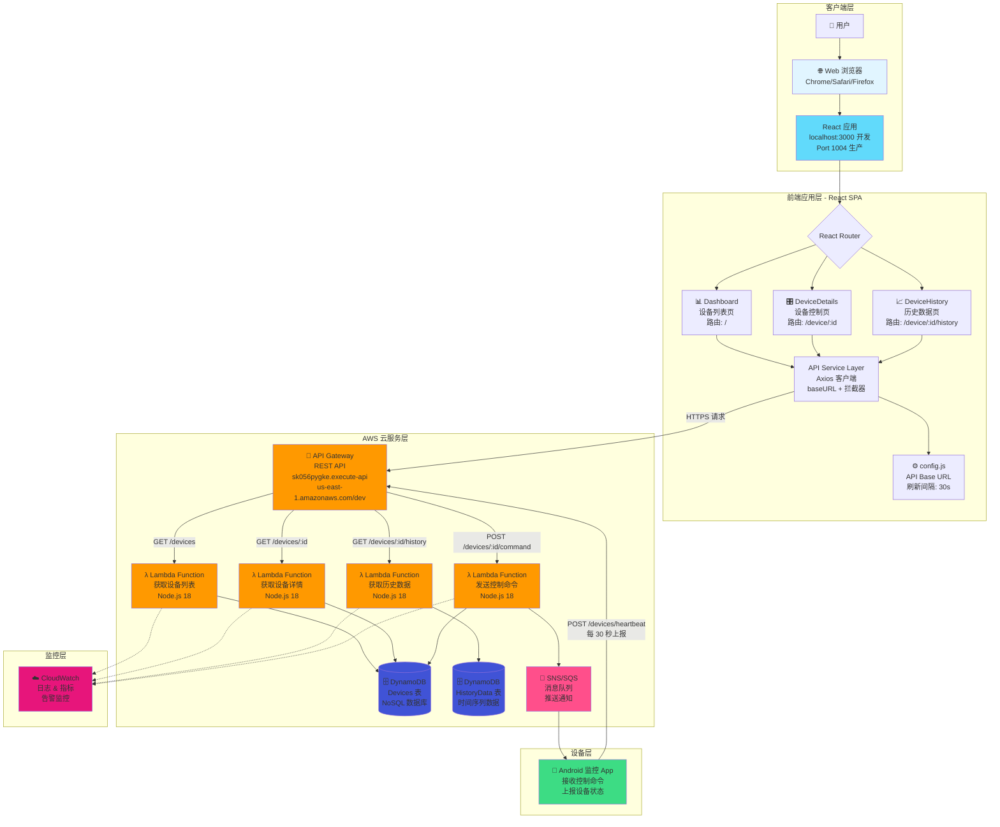
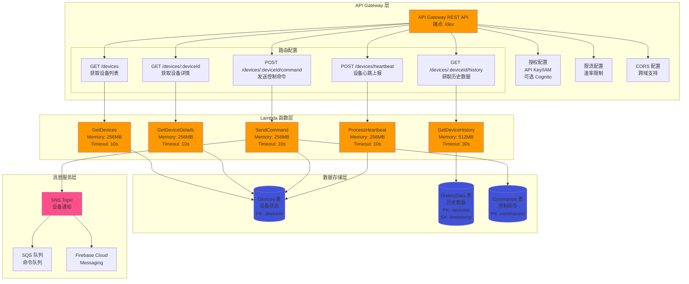
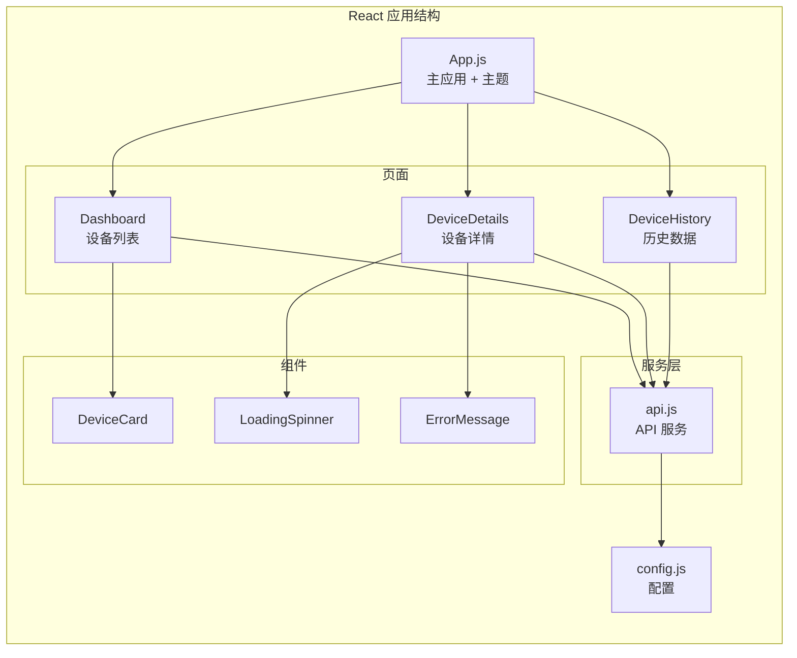
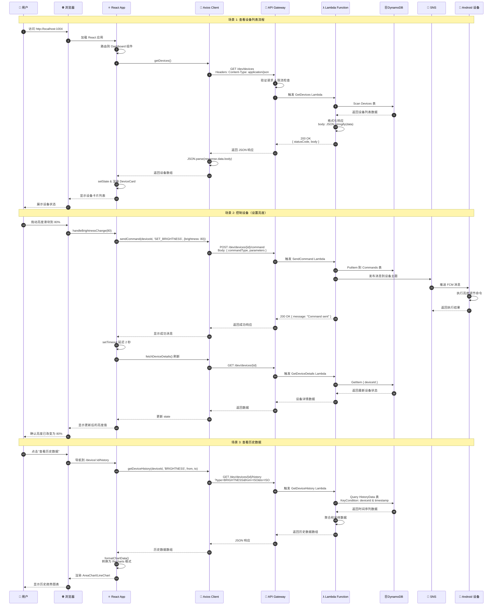
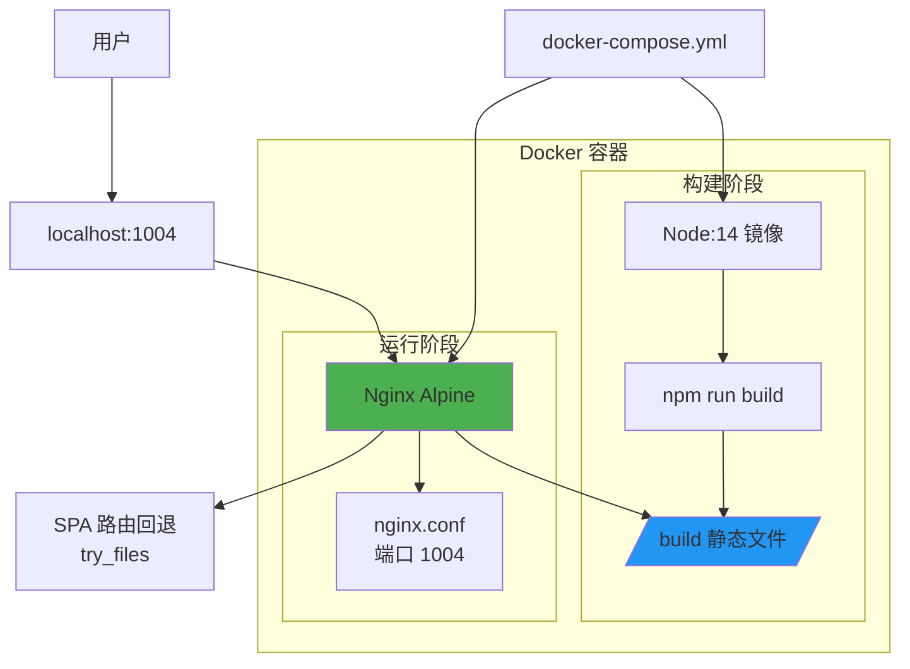

# Android Monitoring System (AMS) - Web Dashboard

一个基于 React 的 Android 设备远程监控和控制系统 Web 仪表板。

## 功能特性

- 📱 实时监控多个 Android 设备状态
- 📊 设备历史数据可视化（亮度、WiFi、蓝牙）
- 🎛️ 远程控制设备（WiFi 开关、蓝牙开关、屏幕亮度调节）
- 🔄 自动刷新（30秒间隔）
- 📈 多时间范围历史数据查询（1小时、6小时、24小时、7天）
- 🐳 Docker 容器化部署支持

## 技术栈

- **前端框架**: React 18.2.0
- **UI 组件库**: Material-UI (MUI) 5.14.20
- **路由**: React Router DOM 6.20.1
- **图表库**: Recharts 2.8.0
- **HTTP 客户端**: Axios 1.6.2
- **构建工具**: React Scripts 5.0.1
- **容器化**: Docker + Docker Compose
- **Web 服务器**: Nginx (Alpine)

## 快速开始

### 前置要求

- Node.js 14+
- npm 或 yarn
- Docker 和 Docker Compose (用于容器化部署)

### 本地开发

```bash
# 安装依赖
npm install

# 启动开发服务器 (http://localhost:3000)
npm start

# 运行测试
npm test

# 构建生产版本
npm run build
```

### Docker 部署

```bash
# 构建并启动容器
docker-compose up --build

# 后台运行
docker-compose up -d

# 停止容器
docker-compose down
```

部署后访问: `http://localhost:1004`

## 系统架构

### 完整系统架构图（文本版）

```
┌─────────────────────────────────────────────────────────────────────────┐
│                         👤 用户 (User)                                   │
└────────────────────────────────┬────────────────────────────────────────┘
                                 │ Browser Access
                                 │ http://localhost:1004
┌────────────────────────────────▼────────────────────────────────────────┐
│                    Frontend Layer (React 18.2.0)                        │
│  ┌─────────────────────────────────────────────────────────────┐       │
│  │                     App.js (主应用)                          │       │
│  │  • ThemeProvider (Material-UI)                               │       │
│  │  • React Router (客户端路由)                                 │       │
│  │  • AppBar (导航栏)                                            │       │
│  └──────────────────────┬──────────────────────────────────────┘       │
│                         │                                                │
│  ┌──────────────────────┼──────────────────────────────────────┐       │
│  │                      │   Page Components                      │       │
│  │  ┌──────────────┐   │   ┌──────────────┐   ┌─────────────┐ │       │
│  │  │  Dashboard   │◄──┼──►│DeviceDetails │   │DeviceHistory│ │       │
│  │  │   (/)        │   │   │ (/device/:id)│   │(/device/:id/│ │       │
│  │  │              │   │   │              │   │   history)  │ │       │
│  │  │ • 设备列表    │   │   │ • WiFi控制   │   │ • 图表展示  │ │       │
│  │  │ • 状态监控    │   │   │ • 蓝牙控制   │   │ • 时间筛选  │ │       │
│  │  │ • 自动刷新    │   │   │ • 亮度调节   │   │ • 数据类型  │ │       │
│  │  └──────┬───────┘   │   └──────┬───────┘   └──────┬──────┘ │       │
│  └─────────┼───────────┴──────────┼──────────────────┼────────┘       │
│            │                       │                  │                  │
│  ┌─────────▼───────────────────────▼──────────────────▼────────┐       │
│  │              Shared Components                                │       │
│  │  • DeviceCard     • LoadingSpinner     • ErrorMessage        │       │
│  └───────────────────────────┬───────────────────────────────────┘       │
│                               │                                           │
│  ┌────────────────────────────▼──────────────────────────────────┐      │
│  │                 API Service Layer (api.js)                     │      │
│  │  • Axios Client (baseURL, timeout: 10s)                       │      │
│  │  • Request Interceptor (日志记录)                             │      │
│  │  • Response Interceptor (错误处理)                            │      │
│  │                                                                │      │
│  │  Methods:                                                      │      │
│  │    - getDevices()           GET  /devices                     │      │
│  │    - getDeviceDetails(id)   GET  /devices/:id                 │      │
│  │    - getDeviceHistory(...)  GET  /devices/:id/history         │      │
│  │    - sendCommand(...)       POST /devices/:id/command         │      │
│  └────────────────────────────┬──────────────────────────────────┘      │
│                                │                                          │
│  ┌────────────────────────────▼──────────────────────────────────┐      │
│  │                  config.js (配置)                              │      │
│  │  • apiBaseUrl: AWS API Gateway Endpoint                       │      │
│  │  • refreshInterval: 30000ms (30秒自动刷新)                    │      │
│  └────────────────────────────┬──────────────────────────────────┘      │
└─────────────────────────────────┼──────────────────────────────────────┘
                                  │ HTTPS/REST
                                  │ Content-Type: application/json
┌──────────────────────────────────▼─────────────────────────────────────┐
│                      AWS Cloud Services Layer                           │
│                                                                          │
│  ┌──────────────────────────────────────────────────────────────┐      │
│  │           🚪 API Gateway (REST API)                           │      │
│  │  Endpoint: sk056pygke.execute-api.us-east-1.amazonaws.com    │      │
│  │  Stage: /dev                                                  │      │
│  │                                                               │      │
│  │  Features:                                                    │      │
│  │    • CORS (跨域支持)                                          │      │
│  │    • Throttling (限流: 10,000 req/sec)                       │      │
│  │    • API Key / IAM 认证 (可选)                               │      │
│  │    • CloudWatch 日志记录                                      │      │
│  └─────────┬────────────────────────────────────────────────────┘      │
│            │                                                             │
│  ┌─────────┼─────────────────────────────────────────────────────┐     │
│  │         │         Lambda Functions (Node.js 18)               │     │
│  │         │                                                      │     │
│  │  ┌──────▼──────────┐  ┌───────────────┐  ┌────────────────┐ │     │
│  │  │ GetDevices      │  │GetDeviceDetails│  │GetDeviceHistory│ │     │
│  │  │ GET /devices    │  │GET /devices/:id│  │GET /devices/:id│ │     │
│  │  │ Memory: 256MB   │  │Memory: 256MB   │  │    /history    │ │     │
│  │  │ Timeout: 10s    │  │Timeout: 10s    │  │Memory: 512MB   │ │     │
│  │  └──────┬──────────┘  └───────┬────────┘  └────────┬───────┘ │     │
│  │         │                     │                     │          │     │
│  │  ┌──────▼──────────┐  ┌──────▼─────────┐                     │     │
│  │  │ SendCommand     │  │ProcessHeartbeat│                     │     │
│  │  │ POST /devices/  │  │POST /devices/  │                     │     │
│  │  │    :id/command  │  │   heartbeat    │                     │     │
│  │  │ Memory: 256MB   │  │Memory: 256MB   │                     │     │
│  │  │ Timeout: 10s    │  │Timeout: 10s    │                     │     │
│  │  └──────┬──────────┘  └───────┬────────┘                     │     │
│  │         │                     │                               │     │
│  │         └──────────┬──────────┴───────────┬──────────────────┘     │
│  │                    │                      │                         │
│  │         ┌──────────▼──────────┐          │                         │
│  │         │  📢 SNS/SQS         │          │                         │
│  │         │  消息队列服务        │          │                         │
│  │         │  • Topic: device-   │          │                         │
│  │         │    commands         │          │                         │
│  │         │  • FCM Push         │          │                         │
│  │         └──────────┬──────────┘          │                         │
│  └────────────────────┼─────────────────────┼─────────────────────────┘
│                       │                     │
│  ┌────────────────────┼─────────────────────▼─────────────────────┐   │
│  │                    │        🗄️ DynamoDB (NoSQL)                │   │
│  │                    │                                            │   │
│  │  ┌─────────────────▼─────────┐  ┌──────────────────────────┐  │   │
│  │  │     Devices 表             │  │   HistoryData 表         │  │   │
│  │  │  PK: deviceId              │  │   PK: deviceId           │  │   │
│  │  │                            │  │   SK: timestamp          │  │   │
│  │  │  Attributes:               │  │                          │  │   │
│  │  │  • lastSeen                │  │   Attributes:            │  │   │
│  │  │  • lastUpdated             │  │   • dataType             │  │   │
│  │  │  • wifi {status, ssid}     │  │   • value                │  │   │
│  │  │  • bluetooth {status,      │  │   • status               │  │   │
│  │  │    pairedDevices}          │  │   • ttl (30天自动清理)   │  │   │
│  │  │  • screen {brightness}     │  │                          │  │   │
│  │  └────────────────────────────┘  └──────────────────────────┘  │   │
│  │                                                                  │   │
│  │  ┌──────────────────────────────────────────────────────────┐  │   │
│  │  │              Commands 表                                  │  │   │
│  │  │  PK: commandId (UUID)                                     │  │   │
│  │  │  GSI: deviceId-timestamp-index                            │  │   │
│  │  │                                                            │  │   │
│  │  │  Attributes:                                              │  │   │
│  │  │  • deviceId                                               │  │   │
│  │  │  • commandType (SET_BRIGHTNESS, TOGGLE_WIFI, etc.)       │  │   │
│  │  │  • parameters                                             │  │   │
│  │  │  • status (PENDING, SENT, EXECUTED, FAILED)              │  │   │
│  │  └──────────────────────────────────────────────────────────┘  │   │
│  └──────────────────────────────────────────────────────────────────┘   │
│                                                                          │
│  ┌──────────────────────────────────────────────────────────────┐      │
│  │              ☁️ CloudWatch (监控和日志)                       │      │
│  │  • Lambda 调用次数、错误率、持续时间                          │      │
│  │  • API Gateway 4xx/5xx 错误率                                │      │
│  │  • DynamoDB 读写容量监控                                      │      │
│  │  • 告警: 错误率 > 5%, 延迟 > 2s                              │      │
│  └──────────────────────────────────────────────────────────────┘      │
└────────────────────────────────┬────────────────────────────────────────┘
                                 │ FCM Push / Pull
                                 │ Command Execution
┌────────────────────────────────▼────────────────────────────────────────┐
│                      📱 Device Layer (Android)                          │
│                                                                          │
│  ┌──────────────────────────────────────────────────────────────┐      │
│  │              Android 监控应用                                  │      │
│  │                                                                │      │
│  │  功能:                                                         │      │
│  │    • 接收 FCM 推送的控制命令                                   │      │
│  │    • 执行设备控制 (WiFi, Bluetooth, Brightness)               │      │
│  │    • 每 30 秒上报设备状态到 API Gateway                       │      │
│  │    • 返回命令执行结果                                          │      │
│  │                                                                │      │
│  │  心跳上报:                                                     │      │
│  │    POST /devices/heartbeat                                    │      │
│  │    Body: { deviceId, wifi, bluetooth, screen, timestamp }    │      │
│  └──────────────────────────────────────────────────────────────┘      │
└──────────────────────────────────────────────────────────────────────────┘

Data Flow:
  1. 用户操作 → React 组件更新 → API Service 发送请求
  2. Axios → API Gateway → Lambda 函数处理
  3. Lambda → DynamoDB 读写 → 返回数据
  4. Lambda → SNS → Android 设备推送命令
  5. Android 设备 → API Gateway → 上报状态更新
```

### 完整系统架构图（Mermaid 图表版）



### AWS 服务层详细架构



### 前端架构



### 详细数据流程图



### 部署架构



## 数据模型设计

### DynamoDB 表结构

#### 1. Devices 表（设备状态表）
```javascript
{
  // 主键
  "deviceId": "device_001",  // Partition Key

  // 设备信息
  "lastSeen": "2025-11-10T10:30:00Z",      // 最后在线时间
  "lastUpdated": "2025-11-10T10:30:00Z",   // 最后更新时间

  // WiFi 状态
  "wifi": {
    "status": "ON",           // ON | OFF
    "ssid": "MyWiFi",         // WiFi 名称
    "signalStrength": -45     // 信号强度
  },

  // 蓝牙状态
  "bluetooth": {
    "status": "ON",           // ON | OFF | Unknown
    "pairedDevices": 3        // 配对设备数量
  },

  // 屏幕信息
  "screen": {
    "brightness": 75,         // 亮度 0-100
    "screenOn": true          // 屏幕是否开启
  }
}
```

#### 2. HistoryData 表（历史数据表）
```javascript
{
  // 复合主键
  "deviceId": "device_001",                // Partition Key
  "timestamp": "2025-11-10T10:00:00Z",     // Sort Key

  // 数据类型
  "dataType": "BRIGHTNESS",   // BRIGHTNESS | WIFI | BLUETOOTH

  // 数据值（根据类型不同）
  "value": 75,               // 用于 BRIGHTNESS (0-100)
  "status": "ON",            // 用于 WIFI/BLUETOOTH (ON/OFF)
  "ssid": "MyWiFi",          // 用于 WIFI (网络名称)
  "pairedDevices": 3,        // 用于 BLUETOOTH (配对数量)

  // TTL（数据过期时间，自动删除旧数据）
  "ttl": 1699632000          // Unix timestamp（例如：保留 30 天）
}
```

#### 3. Commands 表（控制命令表）
```javascript
{
  // 主键
  "commandId": "cmd_12345",  // Partition Key (UUID)

  // 设备和时间
  "deviceId": "device_001",
  "timestamp": "2025-11-10T10:30:00Z",

  // 命令信息
  "commandType": "SET_BRIGHTNESS",  // 命令类型
  "parameters": {
    "brightness": 80
  },

  // 执行状态
  "status": "PENDING",       // PENDING | SENT | EXECUTED | FAILED
  "executedAt": null,        // 执行时间
  "errorMessage": null       // 错误信息
}
```

### API Gateway 路由映射

| HTTP 方法 | API 路径 | Lambda 函数 | DynamoDB 表 | 说明 |
|-----------|---------|-------------|-------------|------|
| GET | `/devices` | GetDevices | Devices | 扫描所有设备 |
| GET | `/devices/{deviceId}` | GetDeviceDetails | Devices | 获取单个设备 |
| GET | `/devices/{deviceId}/history` | GetDeviceHistory | HistoryData | 查询历史数据 |
| POST | `/devices/{deviceId}/command` | SendCommand | Commands, SNS | 发送控制命令 |
| POST | `/devices/heartbeat` | ProcessHeartbeat | Devices | 更新设备状态 |

## API 接口文档

### Base URL

```
https://sk056pygke.execute-api.us-east-1.amazonaws.com/dev
```

可在 `src/config.js` 中修改

### 接口列表

#### 1. 获取所有设备

```http
GET /devices
```

**响应示例**:
```json
{
  "statusCode": 200,
  "body": "{\"devices\":[{\"deviceId\":\"device_001\",\"lastSeen\":\"2025-11-10T10:30:00Z\"}]}"
}
```

**注意**: 响应的 `body` 是字符串格式，需要 JSON 解析

**前端处理** (`src/services/api.js:36-40`):
```javascript
const bodyData = JSON.parse(response.data.body);
return bodyData.devices;
```

---

#### 2. 获取设备详情

```http
GET /devices/{deviceId}
```

**路径参数**:
- `deviceId` (string, required): 设备 ID

**响应示例**:
```json
{
  "deviceId": "device_001",
  "lastUpdated": "2025-11-10T10:30:00Z",
  "wifi": {
    "status": "ON",
    "ssid": "MyWiFi"
  },
  "bluetooth": {
    "status": "ON",
    "pairedDevices": 3
  },
  "screen": {
    "brightness": 75
  }
}
```

---

#### 3. 获取设备历史数据

```http
GET /devices/{deviceId}/history?type={type}&from={from}&to={to}
```

**路径参数**:
- `deviceId` (string, required): 设备 ID

**查询参数**:
- `type` (string, required): 数据类型
  - `BRIGHTNESS` - 屏幕亮度
  - `WIFI` - WiFi 状态
  - `BLUETOOTH` - 蓝牙状态
- `from` (string, optional): 开始时间 (ISO 8601 格式)
- `to` (string, optional): 结束时间 (ISO 8601 格式)

**响应示例**:
```json
{
  "deviceId": "device_001",
  "type": "BRIGHTNESS",
  "data": [
    {
      "timestamp": "2025-11-10T10:00:00Z",
      "value": 75
    },
    {
      "timestamp": "2025-11-10T10:05:00Z",
      "value": 80
    }
  ]
}
```

---

#### 4. 发送控制命令

```http
POST /devices/{deviceId}/command
```

**路径参数**:
- `deviceId` (string, required): 设备 ID

**请求体**:
```json
{
  "commandType": "SET_BRIGHTNESS",
  "parameters": {
    "brightness": 80
  }
}
```

**命令类型**:

| commandType | 说明 | parameters |
|------------|------|------------|
| `SET_BRIGHTNESS` | 设置屏幕亮度 | `{ brightness: 0-100 }` |
| `TOGGLE_WIFI` | 切换 WiFi 状态 | `{ status: "ON" \| "OFF" }` |
| `TOGGLE_BLUETOOTH` | 切换蓝牙状态 | `{ status: "ON" \| "OFF" }` |

**响应示例**:
```json
{
  "statusCode": 200,
  "message": "Command sent successfully"
}
```

---

### 错误处理

所有 API 请求都通过 Axios 拦截器处理:

**请求拦截器** (`src/services/api.js:10-18`):
- 记录请求日志

**响应拦截器** (`src/services/api.js:20-30`):
- 记录响应日志
- 统一错误处理

**错误响应格式**:
```json
{
  "statusCode": 400,
  "error": "Bad Request",
  "message": "Invalid device ID"
}
```

## 页面路由

| 路由 | 组件 | 说明 |
|------|------|------|
| `/` | Dashboard | 设备列表仪表板 |
| `/device/:deviceId` | DeviceDetails | 设备详情和控制页面 |
| `/device/:deviceId/history` | DeviceHistory | 历史数据可视化页面 |

## 配置说明

### API 配置 (`src/config.js`)

```javascript
const config = {
  apiBaseUrl: 'https://your-api-endpoint.com/dev',  // API 基础地址
  refreshInterval: 30000,  // 自动刷新间隔（毫秒）
};
```

### Nginx 配置 (`nginx.conf`)

```nginx
server {
    listen 1004;
    location / {
        root   /usr/share/nginx/html;
        try_files $uri $uri/ /index.html;  # SPA 路由回退
    }
}
```

## 项目结构

```
AMS_Web/
├── public/
│   └── index.html              # HTML 模板
├── src/
│   ├── components/             # 可复用组件
│   │   ├── DeviceCard.js       # 设备卡片组件
│   │   ├── LoadingSpinner.js   # 加载动画
│   │   └── ErrorMessage.js     # 错误消息
│   ├── pages/                  # 页面组件
│   │   ├── Dashboard.js        # 设备列表页
│   │   ├── DeviceDetails.js    # 设备详情页
│   │   └── DeviceHistory.js    # 历史数据页
│   ├── services/               # 服务层
│   │   └── api.js              # API 服务
│   ├── App.js                  # 主应用组件
│   ├── config.js               # 配置文件
│   ├── index.js                # 入口文件
│   └── index.css               # 全局样式
├── docker-compose.yml          # Docker Compose 配置
├── Dockerfile                  # Docker 镜像构建文件
├── nginx.conf                  # Nginx 配置
├── package.json                # 项目依赖
└── README.md                   # 项目文档
```

## 开发指南

### 添加新的设备控制功能

1. 在 `src/services/api.js` 中添加新的 API 函数
2. 在 `src/pages/DeviceDetails.js` 中添加控制 UI
3. 实现命令发送和状态刷新逻辑

示例：
```javascript
// 在 api.js 中
export const sendCustomCommand = async (deviceId, parameters) => {
  const response = await api.post(`/devices/${deviceId}/command`, {
    commandType: 'CUSTOM_COMMAND',
    parameters,
  });
  return response.data;
};

// 在 DeviceDetails.js 中
const handleCustomCommand = async () => {
  await sendCustomCommand(deviceId, { /* params */ });
  setTimeout(fetchDeviceDetails, 2000);
};
```

### 添加新的历史数据类型

1. 在 `src/pages/DeviceHistory.js` 的 `dataType` 状态中添加新类型
2. 在 `formatChartData` 函数中添加数据格式化逻辑
3. 在 `renderChart` 函数中添加对应的图表渲染

## 常见问题

### Q: API 响应解析失败？
A: 检查 API 返回的 `body` 字段是否为字符串格式，需要先用 `JSON.parse()` 解析

### Q: 设备状态更新不及时？
A: 命令发送后，系统会延迟 2-3 秒刷新状态，确保设备有足够时间执行命令

### Q: Docker 容器无法访问？
A: 检查端口 1004 是否被占用，确保 Docker 服务正常运行

### Q: 历史数据为空？
A: 确认时间范围内设备有数据上报，检查 API 接口是否正常

## 性能优化建议

- 调整 `refreshInterval` 以平衡实时性和服务器负载
- 对于大量设备，考虑实现分页或虚拟滚动
- 使用 React.memo 优化组件渲染
- 考虑添加 Service Worker 实现离线功能

